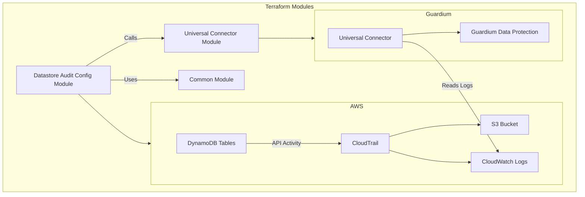

# AWS DynamoDB Monitoring with Guardium Data Protection

This module enables monitoring of existing AWS DynamoDB tables with IBM Guardium Data Protection. It sets up the necessary AWS infrastructure and integrates with Guardium to provide comprehensive database activity monitoring and security for your DynamoDB tables.

## Architecture Overview

The solution works by leveraging AWS CloudTrail to capture DynamoDB API calls, which are then processed through CloudWatch Logs, EventBridge, Lambda, and SQS before being sent to Guardium for analysis and monitoring.

> **Note:** The following diagram is conceptual and provides a general understanding of the data flow. The actual implementation may vary based on your specific configuration and AWS environment.



### Key Components

The monitoring solution consists of these primary components:

1. **AWS DynamoDB Tables**: Your existing DynamoDB tables that you want to monitor.

2. **AWS CloudTrail**: Captures API calls and data events for your DynamoDB tables. CloudTrail records all API activity, including read and write operations.

3. **S3 Bucket**: Stores CloudTrail logs for long-term retention and compliance purposes.

4. **CloudWatch Logs**: Stores the CloudTrail logs in a structured format for real-time monitoring and analysis.

5. **Guardium Universal Connector**: Connects directly to CloudWatch Logs to read and process the DynamoDB activity logs.

6. **Guardium Data Protection**: Analyzes the logs for security threats, compliance violations, and provides monitoring capabilities.


## Prerequisites

- Existing AWS DynamoDB tables
- AWS account with permissions to create CloudTrail, CloudWatch, IAM roles, and S3 buckets
- Guardium Data Protection instance
- Terraform 1.0.0 or later
- AWS CLI configured with appropriate credentials

## Guardium Configuration Prerequisites

Before using this module, you need to perform some one-time manual configurations on your Guardium Data Protection instance. These configurations include:

1. Enabling OAuth client for REST API access
2. Configuring AWS credentials in Universal Connector
3. Setting up SSH access for Terraform

For detailed instructions, please refer to the [Preparing Guardium Documentation](https://github.com/IBM/terraform-guardium-gdp/blob/main/docs/preparing-guardium.md).

## Quick Start

1. Copy the `terraform.tfvars.example` file to `terraform.tfvars` and update it with your configuration:

```bash
cp terraform.tfvars.example terraform.tfvars
```

2. Edit the `terraform.tfvars` file to specify your DynamoDB tables and Guardium connection details.

3. Initialize and apply the Terraform configuration:

```bash
terraform init
terraform apply
```

## Configuration Parameters

### AWS Configuration

| Parameter | Description | Default | Required |
|-----------|-------------|---------|:--------:|
| `aws_region` | AWS region where your DynamoDB tables are located (e.g., us-east-1, eu-west-1) | `"us-east-1"` | Yes |
| `aws_partition` | AWS partition (aws for standard regions, aws-cn for China, aws-us-gov for GovCloud) | `"aws"` | No |
| `name_prefix` | Prefix for resource names created by this module (used for CloudTrail, S3 bucket, etc.) | `"dynamodb-gdp"` | No |
| `dynamodb_tables` | Comma-separated list of DynamoDB table names to monitor (or "all" to monitor all tables in the region) | `"all"` | Yes |

### CloudTrail Configuration

| Parameter | Description | Default | Required |
|-----------|-------------|---------|:--------:|
| `create_cloudtrail_s3_bucket` | Whether to create a new S3 bucket for CloudTrail logs (set to false if you want to use an existing bucket) | `true` | No |
| `aws_log_group` | Name of the CloudWatch log group where CloudTrail logs will be stored | `"dynamodb-logs"` | No |
| `existing_cloudtrail_name` | Name of an existing CloudTrail to use (if provided, the module will use this CloudTrail instead of creating a new one) | `""` | No |
| `existing_cloudwatch_log_group_name` | Name of an existing CloudWatch Log Group to use (if provided, the module will use this Log Group instead of creating a new one) | `""` | No |

### Universal Connector Configuration

| Parameter | Description | Default | Required |
|-----------|-------------|---------|:--------:|
| `enable_universal_connector` | Whether to enable the Universal Connector for monitoring | `true` | No |
| `udc_aws_credential` | Name of the AWS credential stored in Guardium Central Manager (must be created in Guardium first) | - | Yes |
| `csv_start_position` | Start position for log processing ("start" to process all logs or "end" to process only new logs) | `"end"` | No |
| `csv_interval` | Polling interval in seconds for the Universal Connector to check for new logs | `60` | No |
| `csv_event_filter` | Optional filter for CloudWatch events (e.g., "eventName = 'PutItem'") to limit which events are processed | `""` | No |
| `csv_description` | Description for the Universal Connector profile shown in Guardium UI | `"DynamoDB Monitoring"` | No |
| `csv_cluster_name` | Cluster name for the Universal Connector (usually "default" unless you have a custom setup) | `"default"` | No |

### Guardium Integration Configuration

| Parameter | Description | Default | Required |
|-----------|-------------|---------|:--------:|
| `gdp_server` | Hostname or IP address of your Guardium Central Manager | - | Yes, if integration enabled |
| `gdp_port` | Port of the Guardium server (default is 8443 for HTTPS) | `"8443"` | No |
| `gdp_ssh_username` | SSH username for connecting to Guardium server | - | Yes, if integration enabled |
| `gdp_ssh_privatekeypath` | Path to SSH private key for Guardium server authentication | - | Yes, if integration enabled |
| `gdp_username` | Username for Guardium web interface authentication | - | Yes, if integration enabled |
| `gdp_password` | Password for Guardium web interface authentication | - | Yes, if integration enabled |
| `gdp_mu_host` | Hostname or IP address of your Guardium Managed Unit where the connector will be deployed | - | Yes, if integration enabled |
| `client_id` | Client ID for Guardium OAuth authentication (created using grdapi register_oauth_client) | `"client4"` | No |
| `gdp_client_secret` | Client secret for Guardium OAuth authentication | - | Yes, if integration enabled |

### Resource Naming

To avoid naming conflicts with other deployments, it's important to use a unique `name_prefix` value. This prefix is used for all resource names created by this module, including:

- CloudTrail
- CloudWatch Log Group
- S3 bucket
- IAM roles and policies

If you encounter errors like "resource already exists", try using a different `name_prefix` value.

### Other Configuration

| Parameter | Description | Default | Required |
|-----------|-------------|---------|:--------:|
| `tags` | Map of tags to apply to resources | `{}` | No |

## Example Configuration

### Monitoring Existing DynamoDB Tables

Here's an example configuration for monitoring existing DynamoDB tables:

```hcl
# AWS Configuration
aws_region = "us-east-1"
name_prefix = "my-dynamodb-monitoring"

# Specify the existing tables to monitor
dynamodb_tables = "users-table,orders-table,products-table"

# CloudTrail Configuration
create_cloudtrail_s3_bucket = true

# Universal Connector Configuration
enable_universal_connector = true
udc_aws_credential = "my-aws-credential"
csv_start_position = "end"
csv_interval = 60
csv_description = "DynamoDB Monitoring"
csv_cluster_name = "default"

# Guardium Integration Configuration
gdp_server = "guardium.example.com"
gdp_ssh_username = "root"
gdp_ssh_privatekeypath = "~/.ssh/guardium_key"
gdp_username = "admin"
gdp_password = "password"
gdp_mu_host = "guardium-mu.example.com"
client_id = "client"
gdp_client_secret = "your-client-secret"

# Tags
tags = {
  Environment = "production"
  Project     = "data-security"
}
```

### Using Existing CloudTrail and SQS Resources

If you already have CloudTrail and SQS resources set up, you can import them into Terraform and use them with this module:

1. First, create a Terraform configuration that references your existing resources:

```hcl
# Reference existing CloudTrail
data "aws_cloudtrail" "existing" {
  name = "your-existing-cloudtrail-name"
}

# Reference existing SQS queue
data "aws_sqs_queue" "existing" {
  name = "your-existing-sqs-queue-name"
}
```

2. Import the existing resources into your Terraform state:

```bash
# Import CloudTrail
terraform import aws_cloudtrail.existing your-cloudtrail-id

# Import SQS queue
terraform import aws_sqs_queue.existing your-sqs-queue-url
```

3. Configure the module to use your existing resources:

```hcl
module "dynamodb_monitoring" {
  source = "path/to/module"
  
  # Use existing CloudTrail
  create_cloudtrail = false
  cloudtrail_name = data.aws_cloudtrail.existing.name
  
  # Use existing SQS queue
  create_sqs_queue = false
  sqs_queue_name = data.aws_sqs_queue.existing.name
  
  # Other configuration...
  dynamodb_tables = "users-table,orders-table,products-table"
}
```

> Note: The exact variable names may vary depending on the module version. Check the variables.tf file for the correct variable names.

## How It Works

1. **Table Discovery**: The module identifies your existing DynamoDB tables based on the `dynamodb_tables` parameter.

2. **CloudTrail Setup**: A CloudTrail is created to capture API calls and events for your DynamoDB tables. The events are stored in an S3 bucket and sent to CloudWatch Logs.

3. **CloudWatch Integration**: A CloudWatch Log Group is created to store the CloudTrail logs in a structured format.

4. **Universal Connector Configuration**: A Universal Connector configuration file is created and uploaded to your Guardium instance. This configuration tells the connector how to connect to CloudWatch Logs and process the DynamoDB events.

5. **Guardium Integration**: The module connects to your Guardium instance, imports the Universal Connector configuration, and installs the connector. The connector then begins monitoring your DynamoDB tables by reading directly from CloudWatch Logs.

## Monitoring Capabilities

With this setup, Guardium can monitor the following DynamoDB operations:

- Table creation, deletion, and modification
- Item insertion, update, and deletion
- Query and scan operations
- Batch operations
- Access patterns and user activity

## Troubleshooting

### Known Provider Issues


### Provider Authentication Issues

If you encounter authentication issues with the Guardium Data Protection provider, ensure that:

1. You have the correct client ID and secret
2. The Guardium server is accessible from your Terraform environment
3. SSH access to the Guardium server is properly configured

### CloudTrail Setup Issues

If CloudTrail is not capturing DynamoDB events:

1. Verify that the specified DynamoDB tables exist
2. Check that the IAM permissions are correctly configured
3. Ensure that the CloudWatch Log Group is properly set up

### Universal Connector Issues

If the Universal Connector is not processing logs:

1. Verify that the AWS credential is correctly configured in Guardium
2. Check that the CloudWatch Log Group is receiving events
3. Ensure that the Universal Connector is properly installed in Guardium

### Data Flow Troubleshooting

If you're experiencing issues with the data flow from DynamoDB to Guardium:

1. **Verify CloudTrail Data Events**:
   ```bash
   aws cloudtrail lookup-events --lookup-attributes AttributeKey=EventSource,AttributeValue=dynamodb.amazonaws.com
   ```
   This should show recent DynamoDB API calls.

2. **Check CloudWatch Log Group**:
   ```bash
   aws logs describe-log-streams --log-group-name <your-log-group-name>
   ```
   Then view events in a specific log stream:
   ```bash
   aws logs get-log-events --log-group-name <your-log-group-name> --log-stream-name <log-stream-name>
   ```

3. **Verify Universal Connector Configuration**:
   In the Guardium web interface, navigate to:
   - Universal Connector → Manage Profiles
   - Find your profile (named with the AWS region, log group, and account ID)
   - Check that the status is "Active"
   - Verify the CloudWatch Log Group name and AWS region are correct

4. **Check Universal Connector Logs**:
   In the Guardium web interface, navigate to:
   - Universal Connector → Logs
   - Filter for your connector name
   - Look for any error messages or warnings

### Common Error Messages and Solutions

| Error Message | Possible Cause | Solution |
|---------------|---------------|----------|
| "Access denied" in Universal Connector logs | Insufficient IAM permissions | Verify the AWS credentials have CloudWatch Logs read permissions |
| "Connection timeout" in Universal Connector | Network connectivity issues | Check network settings and security groups between Guardium and AWS |
| "Invalid credential" in Guardium logs | Incorrect AWS credentials | Update the credential in Guardium Universal Connector → Credential Management |
| "No data events found" in CloudTrail | Data events not enabled | Verify CloudTrail is configured with data events for DynamoDB tables |
| "CloudWatch Log Group not found" | Incorrect log group name | Verify the log group name in the Universal Connector configuration |
| "Failed to parse CloudWatch logs" | Log format issues | Ensure CloudTrail is properly configured to send logs to CloudWatch |

## Advanced Configuration

### Monitoring All DynamoDB Tables

To monitor all DynamoDB tables in your AWS account, set:

```hcl
dynamodb_tables = "all"
```

### Custom CloudTrail Configuration

You can customize the CloudTrail configuration by setting:

```hcl
create_cloudtrail_s3_bucket = true
```

### Using Existing CloudTrail and CloudWatch Log Group

If you already have CloudTrail and CloudWatch Log Group resources set up for monitoring DynamoDB, you can configure this module to use those existing resources instead of creating new ones:

```hcl
# Use existing CloudTrail and CloudWatch Log Group
existing_cloudtrail_name = "my-existing-cloudtrail"
existing_cloudwatch_log_group_name = "/aws/cloudtrail/my-existing-log-group"

# Make sure your existing CloudTrail is configured to monitor DynamoDB tables
# and is sending logs to the specified CloudWatch Log Group

# Other configuration remains the same
enable_universal_connector = true
udc_aws_credential = "my-aws-credential"
```

Important considerations when using existing resources:

1. **CloudTrail Configuration**: Ensure your existing CloudTrail is configured to capture data events for the DynamoDB tables you want to monitor.

2. **CloudWatch Log Group**: Verify that your CloudTrail is sending logs to the CloudWatch Log Group you specify.

3. **IAM Permissions**: The module will still create an IAM role for CloudTrail to write to CloudWatch Logs. If your CloudTrail is already configured with a role, you may need to adjust the module code accordingly.

4. **Log Format**: The Universal Connector expects logs in a specific format. Ensure your existing CloudTrail is generating logs in the expected format.

## Performance Considerations

### Log Volume Management

The volume of logs generated depends on the activity level of your DynamoDB tables. Consider the following:

1. **Selective Monitoring**: For high-traffic environments, consider monitoring only specific tables rather than all tables.

2. **Filtering Events**: Use the `csv_event_filter` parameter to filter specific event types:
   ```hcl
   csv_event_filter = "eventName = 'PutItem' OR eventName = 'DeleteItem'"
   ```

3. **Polling Interval**: Adjust the polling interval based on your monitoring needs and log volume:
   ```hcl
   csv_interval = 300  # Poll every 5 minutes instead of every minute
   ```

### Resource Sizing

1. **Lambda Function**: The default Lambda function configuration is suitable for most workloads. For high-volume environments, consider increasing the memory allocation:
   ```hcl
   lambda_memory_size = 512  # Increase from default
   lambda_timeout = 300      # Increase timeout if needed
   ```

2. **SQS Queue**: The default SQS queue configuration uses standard queues. For environments where message ordering is critical:
   ```hcl
   sqs_fifo_queue = true
   ```

3. **CloudWatch Log Retention**: Adjust the log retention period to balance storage costs with compliance requirements:
   ```hcl
   cloudwatch_log_retention_days = 90  # Default is 30 days
   ```

### Cost Optimization

1. **CloudTrail Multi-Region**: If you only need to monitor DynamoDB in a single region, ensure you're not using a multi-region trail:
   ```hcl
   cloudtrail_is_multi_region_trail = false
   ```

2. **S3 Lifecycle Policies**: Consider adding lifecycle policies to your CloudTrail S3 bucket:
   ```hcl
   s3_lifecycle_rule_enabled = true
   s3_lifecycle_days_to_glacier = 90
   s3_lifecycle_days_to_expiration = 365
   ```

3. **Selective Data Events**: Configure CloudTrail to capture only the specific data events you need for monitoring.

## Security Considerations

- The module requires permissions to create and manage CloudTrail, CloudWatch, IAM roles, and S3 buckets
- Guardium credentials are stored in the Terraform state file, so ensure that your state file is properly secured
- Consider using AWS KMS to encrypt the CloudTrail logs and CloudWatch log group
- Use IAM roles with least privilege principles for all components
- Regularly rotate credentials used for Guardium integration


### Implementation Recommendations


1. **Log Retention**: Adjust log retention periods based on your regulatory requirements:
   ```hcl
   cloudwatch_log_retention_days = 365  # For regulations requiring 1-year retention
   ```

2. **Encryption**: Enable encryption for all components:
   ```hcl
   enable_cloudtrail_encryption = true
   cloudwatch_logs_encryption = true
   sqs_encryption = true
   ```

## Outputs

| Name | Description |
|------|-------------|
| `cloudwatch_log_group_name` | Name of the CloudWatch Log Group |
| `cloudwatch_log_group_arn` | ARN of the CloudWatch Log Group |
| `formatted_cloudwatch_logs_group_arn` | Formatted ARN of the CloudWatch Log Group for CloudTrail |
| `cloudtrail_name` | Name of the CloudTrail |
| `cloudtrail_s3_bucket` | Name of the S3 bucket for CloudTrail logs |
| `iam_role_arn` | ARN of the IAM role for CloudTrail |

## Contributing

Contributions to this module are welcome. Please ensure that your changes are well-tested and documented.
